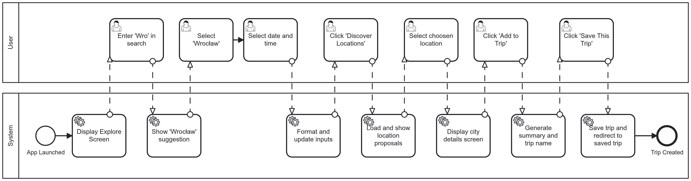
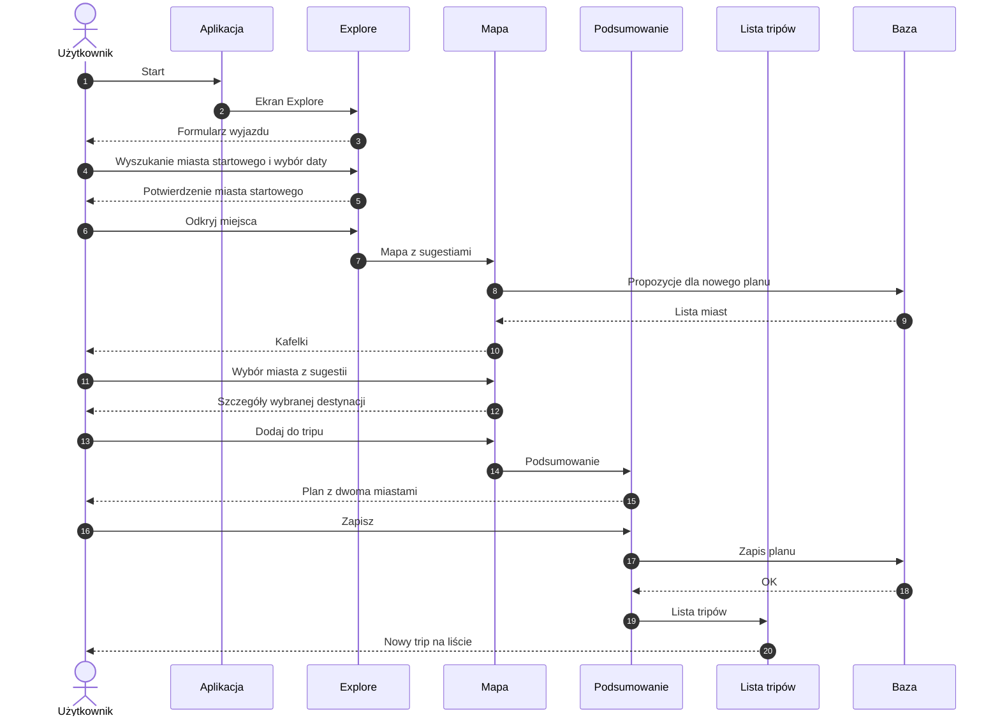
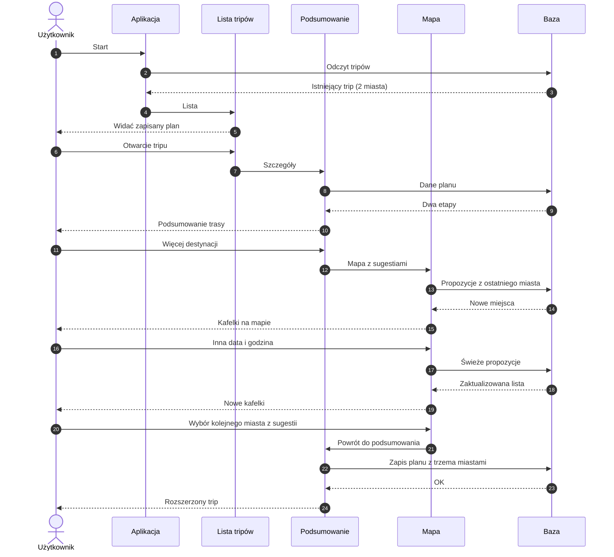
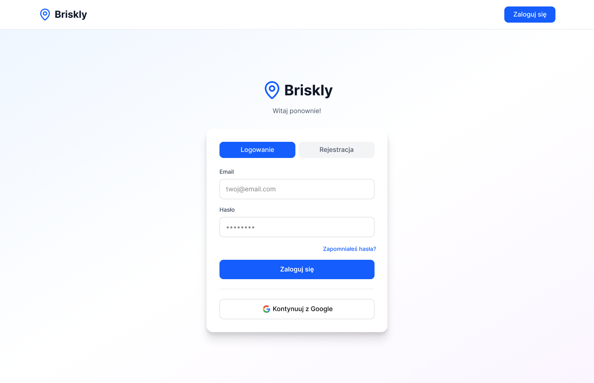
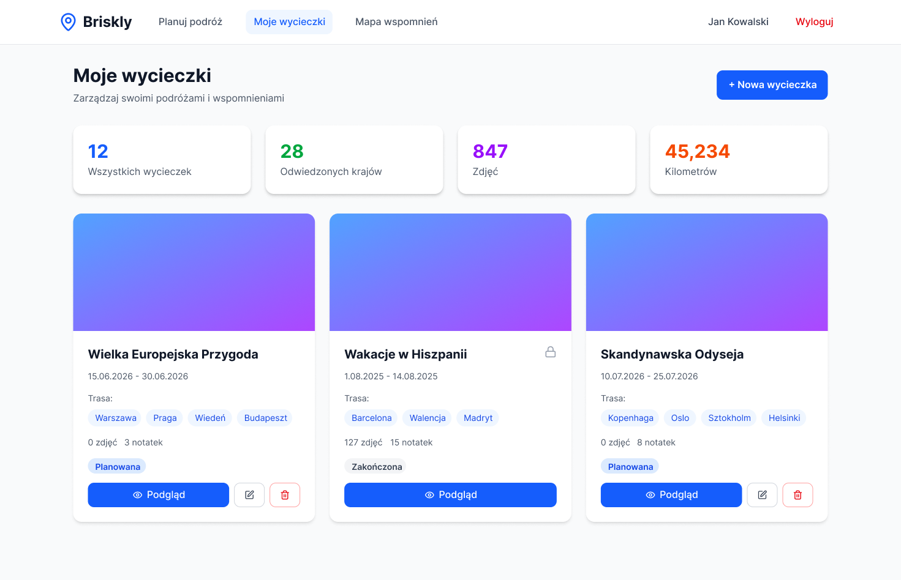
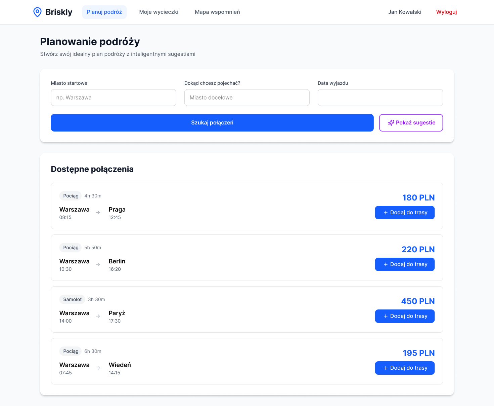
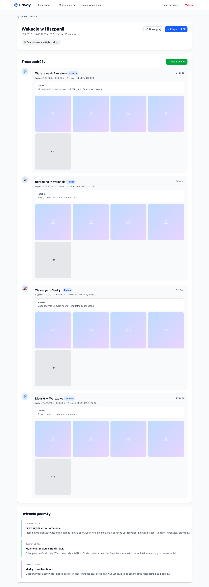
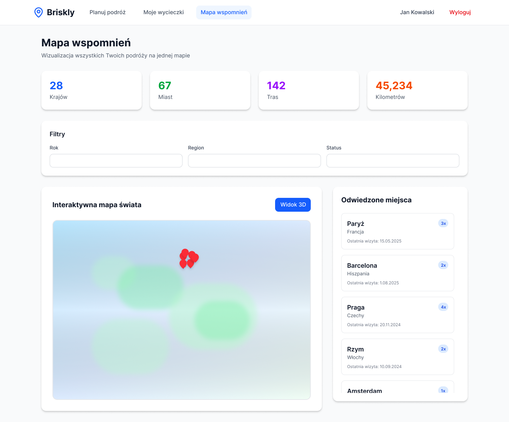
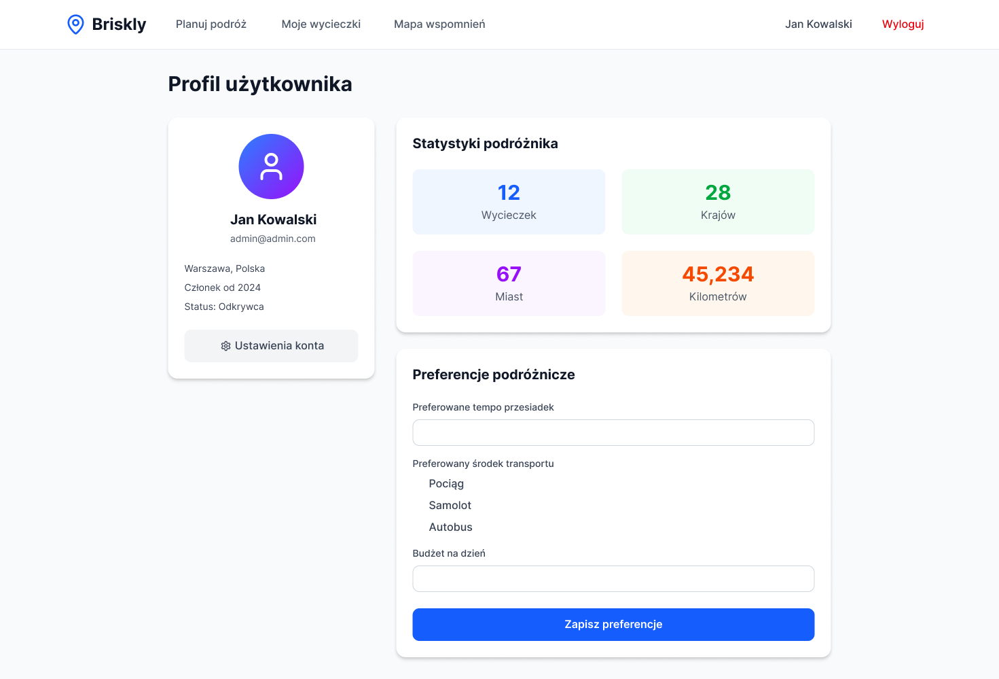
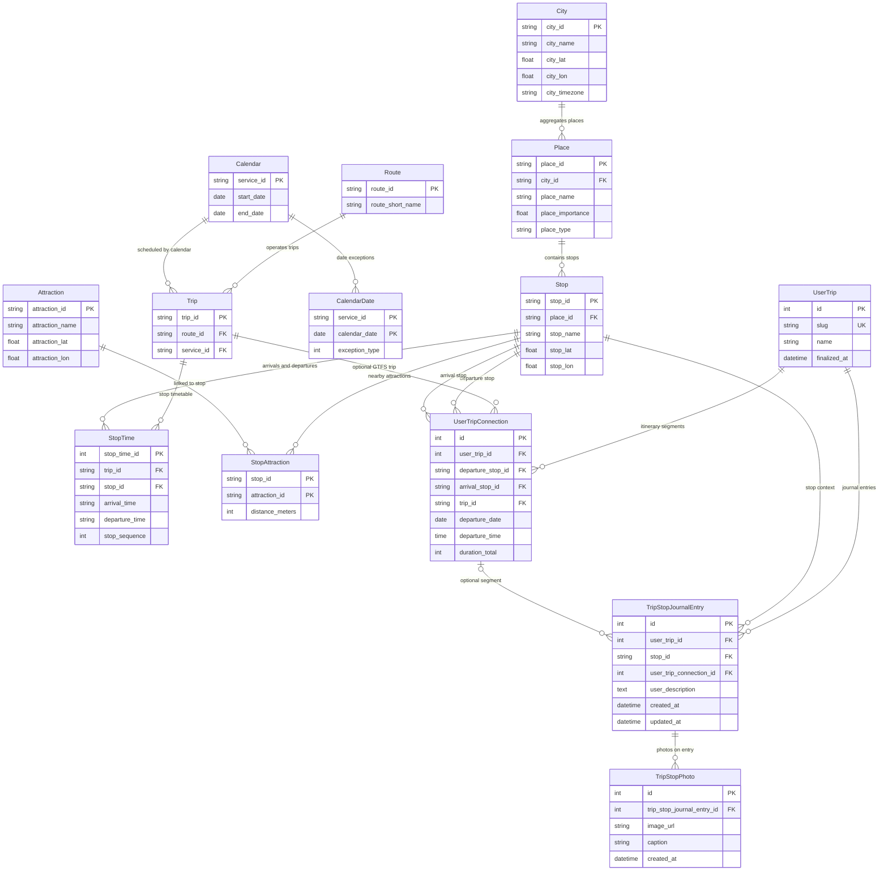

# Briskly

**Fullstack Duo**

- Michał Banaszkiewicz  
- Dawid Błaszczyk

---

## Spis treści

- [1) Słowny opis wybranego tematu oraz charakterystyka problemów do rozwiązania](#1-słowny-opis-wybranego-tematu-oraz-charakterystyka-problemów-do-rozwiązania)
- [2) Zakres funkcjonalny systemu](#2-zakres-funkcjonalny-systemu)
- [3) Repozytorium kodu i pipeline CI](#3-repozytorium-kodu-i-pipeline-ci)
- [4) Opis projektowanego systemu oraz diagramy procesów](#4-opis-projektowanego-systemu-oraz-diagramy-procesów)
- [5) Spis ekranów wraz z makietami (mockupy)](#5-spis-ekranów-wraz-z-makietami-mockupy)
- [6) Wybór i opis architektury aplikacji wraz z uzasadnieniem (MVC, MVVM itd.)](#6-wybór-i-opis-architektury-aplikacji-wraz-z-uzasadnieniem-mvc-mvvm-itd)
- [7) Propozycja schematu bazy danych (diagram ER)](#7-propozycja-schematu-bazy-danych-diagram-er)
- [8) Propozycja stosu technologicznego](#8-propozycja-stosu-technologicznego)

---

## 1) Słowny opis wybranego tematu oraz charakterystyka problemów do rozwiązania

### Charakterystyka ogólna

Projekt „Briskly” to aplikacja webowa realizująca dwa główne cele: **optymalizację logistyczną złożonych podróży** (z uwzględnieniem **sugerowanych destynacji** pod kątem **atrakcyjności lokacji**) oraz **cyfrową archiwizację doświadczeń turystycznych**. System dedykowany jest użytkownikom planującym trasy wieloetapowe, wymagające precyzyjnej synchronizacji czasowej oraz sprawnego zarządzania dokumentacją multimedialną z przebiegu wyprawy.

#### Moduł logistyczny i planowanie strukturalne

Moduł logistyczny ma na celu **rozbudowę logiki biznesowej wyszukiwarki połączeń**, aby umożliwić **sugerowanie destynacji do zwiedzenia** na podstawie atrakcyjności lokacji, czasu i miejsca startu. Użytkownik może też **złożyć plan z kilku połączeń w jednym miejscu**, zamiast **długo układać wszystko ręcznie w edytorze tekstowym**. Wielu rozwiązań na rynku **nie łączy** aktualnych **danych od przewoźników** z **budowaniem rozbudowanych planów podróży**.

**Od strony technicznej** moduł pomaga **ograniczać błędy** przy planowaniu **złożonych tras** poprzez:

- **Sugestie destynacji:** ranking lub podpowiedzi miejsc do zwiedzenia **według atrakcyjności lokacji**, spięte z punktem startu, czasem podróży i dostępnością połączeń.
- **Wyszukiwanie relacyjne:** mechanizm wyszukiwania miast oraz bezpośrednich połączeń transportowych.
- **Algorytm synchronizacji czasu:** automatyczne przeliczanie parametrów czasowych z uwzględnieniem zmian stref czasowych, zapewniające spójność harmonogramu w skali globalnej.
- **Zarządzanie oknami czasowymi:** definiowanie maksymalnego interwału oczekiwania i filtrowanie połączeń pod kątem preferowanego tempa podróży.
- **Sekwencyjne budowanie etapów:** składanie odcinków w jedną, chronologiczną strukturę wycieczki.

#### Moduł dokumentacji i personalizacji

Warstwa funkcjonalna odpowiedzialna za gromadzenie danych subiektywnych i materiałów wizualnych z poszczególnych węzłów podróży.

- **Profilowanie stacji/punktów trasy:** dedykowana przestrzeń na dane (meta-opisy) dla kolejnych etapów.
- **Zarządzanie treścią multimedialną:** asocjacja plików graficznych z lokalizacjami i etapami podróży wraz z komentarzami autorskimi.
- **Archiwizacja doświadczeń:** tworzenie narracyjnych wpisów (dzienników) zintegrowanych z technicznym planem wycieczki.

#### Moduł wizualizacji danych i interakcji

Warstwa odpowiedzialna za agregację danych historycznych oraz mechanizmy prezentacji i udostępniania zasobów.

- **Zatwierdzanie i wersjonowanie:** finalizacja planu generująca stały, interaktywny podgląd wycieczki do celów udostępniania zewnętrznego.
- **Globalna Mapa Wspomnień:** widok mapy nakładający historyczne trasy użytkownika na wspólny model geograficzny; umożliwia analizę zasięgu podróży oraz wizualizację „siatki połączeń życiowych” w formie graficznej.

### Charakterystyka problemów implementacyjnych

#### 1. Integralność czasowa w środowisku wielostrefowym

Konieczne jest opracowanie mechanizmu zapewniającego spójność chronologiczną planu przy przemieszczaniu się między różnymi strefami czasowymi. Wymaga to ujednolicenia zapisu dat i godzin w bazie oraz ich przeliczania na czas lokalny dla każdego etapu podróży.

#### 2. Relacyjne powiązanie danych strukturalnych z obiektami multimedialnymi

Należy zaprojektować strukturę bazy umożliwiającą trwałe powiązanie technicznych parametrów trasy z zasobami tworzonymi przez użytkownika, w szczególności relacyjność między konkretnym punktem podróży a przypisanymi do niego zdjęciami i opisami.

#### 3. Wydajność wizualizacji przestrzennej na mapie zbiorczej

Przy prezentacji wszystkich odbytych podróży pojawia się problem renderowania dużej liczby obiektów geograficznych, przy znacznym nagromadzeniu tras może dochodzić do spadku płynności działania aplikacji.

#### 4. Wersjonowanie stanów i bezpieczne udostępnianie

Trzeba zdefiniować przejście podróży z fazy edycji do fazy archiwalnej. Kluczowe jest wprowadzenie mechanizmu blokady danych uniemożliwiającego przypadkową zmianę już zrealizowanego planu oraz model bezpiecznego udostępniania osobom trzecim podglądu wycieczki bez możliwości edycji.

#### 5. Model atrakcyjności lokacji i spójność z logistyką

**Sugerowanie destynacji** wymaga **źródeł i reguł oceny atrakcyjności** (np. dane zewnętrzne, proste wagi, preferencje użytkownika) oraz **powiązania ich z realnymi połączeniami**.

### Kontekst konkurencyjny

- **Logistyka + sens podróży:** typowe wyszukiwarki rozkładów skupiają się na **dojściu z A do B**; Briskly dodaje warstwę **sugerowania destynacji do zwiedzenia** wg **atrakcyjności lokacji** i kontekstu (start, czas).
- **Spójność logistyczna i narracyjna:** jeden system łączy wyszukiwanie połączeń, **układanie kilku etapów**, sugestie miejsc oraz warstwę wspomnień.
- **Świadome planowanie w czasie:** strefy czasowe i okna transferowe w jednym modelu harmonogramu.
- **Archiwum podróży w jednym miejscu:** historia wycieczek i „mapa wspomnień” zamiast rozproszenia po plikach.

---

## 2) Zakres funkcjonalny systemu

### 1. Zarządzanie kontem i profilem użytkownika

- **Rejestracja i autoryzacja:** tworzenie konta, logowanie, bezpieczna sesja lub token. Planowane jest także **logowanie SSO** z wykorzystaniem **Google Identity**.
- **Personalizacja profilu:** preferencje podróżnicze (np. preferowane tempo przesiadek).
- **Statystyki podróżnika:** podsumowania w rodzaju liczby zrealizowanych wypraw, odwiedzonych krajów, czy też przebytych odcinków na podstawie danych zapisanych w systemie.

### 2. Moduł planowania logistycznego

- **Sugestie destynacji do zwiedzenia** na podstawie **atrakcyjności lokacji** oraz kontekstu (miejsce i czas startu, ewentualnie preferencje użytkownika), **powiązane z dostępnymi połączeniami**.
- **Wyszukiwanie miast** z podpowiedziami i ograniczeniem liczby wyników.
- **Wyszukiwanie bezpośrednich połączeń** z wybranego miasta dla wskazanej daty i godziny, z uwzględnieniem strefy czasowej i maksymalnego czasu oczekiwania.
- **Tworzenie i przegląd listy wycieczek** użytkownika, **podgląd szczegółów** pojedynczej wycieczki, **usuwanie** wycieczki.
- **Uzupełnianie metadanych wycieczki** po zebraniu odcinków (m.in. nazwa, **zakres dat wyliczany z odcinków**, miniatura wyliczana z odwiedzanych miejsc).
- **Lista odcinków** przypisanych do wycieczki, **dodawanie odcinka**, **podgląd i usunięcie** pojedynczego odcinka.

### 3. Moduł dokumentacji i dziennika podróży

- **Multimedialny notatnik:** komentarze i notatki przywiązane do etapu trasy.
- **Repozytorium mediów:** przesyłanie zdjęć do konkretnego punktu.
- **Dziennik narracyjny:** układanie wpisów w spójną opowieść zsynchronizowaną z osią czasu wyprawy.

### 4. Wizualizacja i archiwizacja

- **Lista wycieczek** jako proste **archiwum planów**.
- **Interaktywna mapa globalna:** zbiorcze wyświetlanie odbytych tras i „siatki połączeń”.
- **Filtrowanie historyczne:** przegląd według dat lub regionów.
- **Tryb archiwalny:** zamrożenie zakończonej podróży i blokada edycji logistycznej w celu ochrony integralności wspomnień.

### 5. Udostępnianie i interakcje społeczne

- **Publiczny podgląd wycieczki:** unikalny identyfikator lub link umożliwiający osobom trzecim przegląd bez edycji.
- **Eksport:** wygenerowanie podsumowania w formie czytelnej offline (np. PDF z planem i materiałami graficznymi).

---

## 3) Repozytorium kodu i pipeline CI

**Repozytorium:** prace projektowe będą prowadzone są w repozytorium **Git** na **GitHub**. Planujemy dodać pipeline CI.

### Główne elementy pipeline CI

- **Linting:**
  - **Django:** Flake8 lub Ruff.
  - **React:** ESLint oraz Prettier (spójność kodu JavaScript/TypeScript).
- **Build check:** automatyczna próba zbudowania projektu przy każdym PR, aby wykryć błędy konfiguracji i brakujące zależności (np. w `requirements.txt` lub `package.json`) przed scaleniem zmian.

---

## 4) Opis projektowanego systemu oraz diagramy procesów

System Briskly składa się z **warstwy API (backend)**, **warstwy prezentacji (frontend SPA)** oraz **warstwy danych** obejmującej import **GTFS**, modele planu użytkownika oraz multimedia przy przystankach.

### Proces 1: Budowa planu wycieczki z odcinków komunikacji

Proces odpowiada **rdzeniowi modułu logistycznego**: użytkownik zbiera **UserTripConnection** w ramach **UserTrip**, korzystając z danych **GTFS** (Trip, StopTime, Stop) oraz powiązań czasu i stref.

**Diagram BPMN:** interakcja przy pierwszym utworzeniu tripu w aplikacji, od uruchomienia po zapis planu.

#### Proces 2: Pierwsze złożenie wycieczki i zapis planu

Proces realizuje **cel modułu planowania**: umożliwia użytkownikowi **przejście od wyboru kontekstu wyjazdu do trwałego zapisu planu** z wykorzystaniem mapy z sugestiami destynacji i podsumowania tak aby wycieczka stała się **obiektem domenowym** widocznym w archiwum planów, a nie tylko sesją w przeglądarce.

#### Proces 3: Uzupełnienie istniejącej wycieczki o kolejną destynację

Proces odpowiada na potrzebę **rozbudowy trasy już po utworzeniu planu**: użytkownik wraca do wycieczki, ponownie korzysta z sugestii, dobiera kolejne miasto i **utrwala zmianę** w bazie bez tworzenia nowej wycieczki od zera.

---

## 5) Spis ekranów wraz z makietami (mockupy)

Makiety to **PNG w katalogu [`assets/figma/`](assets/figma/)** (eksport z Figmy). W zestawieniu są wyłącznie ekrany, dla których istnieje plik w repozytorium.

| Lp. | Ekran / widok | Krótki opis | Plik |
|-----|----------------|-------------|------|
| 1 | Logowanie i rejestracja | Formularze uwierzytelnienia użytkownika | `assets/figma/figma-logowanie.png` |
| 2 | Lista wycieczek (dashboard) | Archiwum planów użytkownika, wejście w szczegóły | `assets/figma/figma-moje-wycieczki.png` |
| 3 | Planowanie podróży | Wyszukiwarka, kontekst wyjazdu, mapa z sugestiami destynacji | `assets/figma/figma-planuj-podróż.png` |
| 4 | Szczegóły wycieczki | Nazwa, agregowany zakres dat, miniatura, lista odcinków | `assets/figma/figma-podglad-wycieczki.png` |
| 5 | Mapa wspomnień | Zbiorcza mapa historycznych tras | `assets/figma/figma-mapa-wspomnień.png` |
| 6 | Profil / ustawienia | Preferencje podróży, statystyki | `assets/figma/figma-profil-użytkownika.png` |

### Podgląd makiet

#### 1. Logowanie i rejestracja

#### 2. Lista wycieczek (dashboard)

#### 3. Planowanie podróży (wyszukiwarka, mapa, sugestie)

#### 4. Szczegóły wycieczki

#### 5. Mapa wspomnień

#### 6. Profil użytkownika

---

## 6) Wybór i opis architektury aplikacji wraz z uzasadnieniem (MVC, MVVM itd.)

### 1. Architektura rozdzielona (klient–serwer z wyraźnym API)

**Co przyjmujemy:** backend i frontend jako **oddzielne warstwy**, komunikujące się przez **udokumentowane API**.

**Dlaczego:** tak można **równolegle** projektować endpointy i interfejs, testować API oraz w przyszłości podłączyć **innego klienta** (np. aplikację mobilną) bez przebudowy całej logiki po stronie serwera.

### 2. Warstwa serwera w układzie MTV (Model, Template, View)

**Co przyjmujemy:** po stronie serwera podział na **model** (dane i reguły biznesowe), **widoki** obsługi żądań oraz warstwę odpowiadającą za **prezentację wobec klienta**. Przy aplikacji API rolę „szablonu” pełnią zwykle **serializowane odpowiedzi** (np. JSON), a nie statyczny HTML.

**Dlaczego:** układ **MTV** porządkuje kod serwera przy rozbudowanej domenie (wycieczki, odcinki, multimedia, logistyka, reguły sugestii destynacji) i oddziela **trwałe modele** od **sposobu wystawienia danych** na zewnątrz.

### 3. Klient oparty o komponenty i stan (bogaty klient / SPA)

**Co przyjmujemy:** interfejs jako zestaw **komponentów UI** z **lokalnym lub globalnym stanem**, działający jako **aplikacja jednostronicowa**: zmiany planu, mapy i list odświeżają wybrane fragmenty widoku, zamiast przeładowywać całą stronę przy każdej akcji.

**Dlaczego:** Briskly wymaga **intensywnej interakcji** (mapa, harmonogram wielu połączeń, filtry czasu, sugestie destynacji). Model „bogatego klienta” jest do tego **naturalnym dopasowaniem**; inspiracja **MVVM** (rozdział stanu od widoku) realizuje się tu przez **komponenty i przepływ danych**, bez narzucania konkretnej biblioteki w tym punkcie.

### 4. Podsumowanie uzasadnienia

Łącznie: **rozdzielony system**, **serwer w konwencji MTV**, **klient komponentowy z API REST** daje spójny obraz zgodny z wymaganiami projektu i ułatwia podział pracy oraz utrzymanie kodu w małym zespole.

---

## 7) Propozycja schematu bazy danych (diagram ER)

Schemat składa się z **warstwy GTFS i planu podróży** oraz **planowanego rozszerzenia** pod **dokumentację wizyt przy przystankach** (zdjęcia, notatki, opisy) po **zatwierdzeniu wycieczki**.

### Diagram związków encji (ER)

---

## 8) Propozycja stosu technologicznego

### Backend: Django (MTV)

Django formalnie stosuje wzorzec MTV (Model, Template, View), zbliżony do klasycznego MVC:

- **Model:** warstwa danych i logiki biznesowej (**PostgreSQL** w **Supabase**): struktura wycieczek, odcinków, multimedia. W module logistycznym także reguły **oceny atrakcyjności lokacji**, **sugestii destynacji** oraz powiązanie z **terminami połączeń**.
- **Template:** w miejsce szablonów HTML zwracane są odpowiedzi **JSON** generowane przez **Django REST Framework**.
- **View:** logika obsługi żądań HTTP, komunikacja z modelami, zwracanie danych do klienta.

**Uzasadnienie:** Django dostarcza zwarty zestaw narzędzi (ORM, autoryzacja, panel administracyjny), co skraca budowę stabilnego modułu logistycznego i warstwy API.

### Frontend: React (komponenty i stan)

- **Komponenty:** niezależne, wielokrotnego użytku części interfejsu (np. etap trasy, lista połączeń, fragment mapy).
- **Stan aplikacji:** lokalnie (`useState`, `useContext`) lub globalnie (np. Redux, Zustand), aby interfejs natychmiast reagował na zmianę dat, filtrów lub wyboru destynacji.

**Uzasadnienie:** Widok Briskly jest **silnie interaktywny**: składanie wielu połączeń, harmonogram, mapa i **sugestie destynacji** wymagają częstych, punktowych aktualizacji **bez przeładowywania strony**. React dobrze to wspiera, a szeroki ekosystem bibliotek (mapy, formularze, kalendarze) przyspiesza implementację i utrzymanie frontendu w małym zespole.

### Komunikacja: RESTful API

Warstwy łączy **Django REST Framework**. API jest **bezstanowe (stateless)**. Każde żądanie z Reacta zawiera informacje potrzebne do obsługi (np. token JWT).

### Dane i tożsamość

- **Baza danych:** **PostgreSQL** hostowany w **Supabase**.
- **Uwierzytelnianie:** obok klasycznego konta w aplikacji przewidziane jest **SSO przez Google Identity** (logowanie kontem Google), zgodnie z zakresem modułu konta w sekcji funkcjonalnej.

### Uzasadnienie architektury hybrydowej

Podział backend / frontend wynika z wymagań projektu:

- **Mapa i harmonogram:** pełne renderowanie stron po stronie serwera (SSR) byłoby mało wygodne przy „Globalnej Mapie Wspomnień” i dynamicznym planie, a React umożliwia płynną pracę na mapie i na osi czasu.
- **Praca równoległa:** rozdział warstw pozwala równocześnie rozwijać endpointy API i interfejs na podstawie uzgodnionej dokumentacji.
- **Skalowalność:** REST ułatwia późniejsze podłączenie aplikacji mobilnej korzystającej z tego samego backendu.
- **Multimedia:** **Django Storage** i obsługa plików po stronie serwera, w połączeniu z przesyłaniem zdjęć z Reacta, wspierają wygodne tworzenie dziennika podróży.
